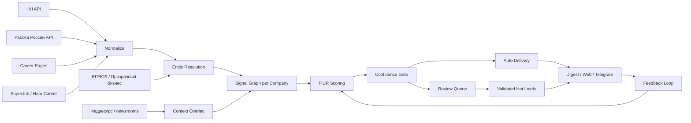
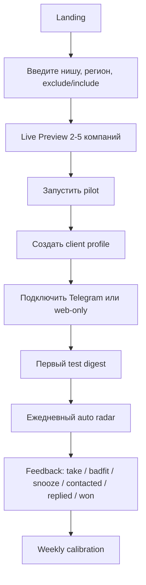

# Автоматический премиальный Recruitment Client Radar для рекрутинговых агентств в России

## Executive summary

Лучший путь для проекта — не превращать его в ещё одну ATS/CRM-платформу и не делать “парсер вакансий с красивым UI”, а собрать **автоматический client-intelligence продукт** для агентств: self-serve на входе, premium assisted на монетизации, evidence-first по данным и quality-first по выдаче. На рынке России публично доминируют продукты для автоматизации найма и candidate workflow — такие как urlХантфлоуturn7search0, urlTalantixturn7search1, urlSkillazturn7search2, urlПотокturn7search3 и urlAmazingHiringturn10search0 — тогда как category-level продукт “hiring intelligence for recruitment agencies” заметно сильнее выражен у глобальных игроков вроде urlSignalsAPIturn8search0 и urlRecruit Signalsturn8search1. Это означает: **локально ниша ещё не закреплена как отдельная категория, а globally уже доказано, что спрос на неё существует**. citeturn12view5turn12view6turn12view7turn12view8turn10search0turn8search0turn8search1

По локальному анализу репозитория и ZIP видно, что у вас уже есть сильное ядро: Next.js-приложение, Postgres-схема с `orgs`, `signals`, `org_source_refs`, `client_profiles`, `digest_runs`, `digest_candidates`, source registry, onboarding, Telegram delivery и n8n workflow. Но проект пока находится между “умным прототипом” и “готовым к рекламе продуктом”. Самые важные gaps: HH-centric scoring и слишком узкая signal logic, незавершённый self-serve checkout state, утечки чувствительных артефактов в архиве, слабая confidence-модель, и слишком простая связка “вакансии → score → opener”. Технически это не повод пересматривать идею. Наоборот: это означает, что нужно **дожать продукт до системного качества**, а не менять направление.

Для российского контура запуск такого продукта должен быть сразу спроектирован как privacy-aware и legally conservative. Базовый нормативный контур — 152‑ФЗ, уведомление об обработке оператором в urlРоскомнадзорturn0search5 до начала обработки (кроме исключений), процедуры уведомления об инцидентах, отдельное уведомление о трансграничной передаче, российская локализация баз персональных данных граждан РФ, а также организационно-технические меры защиты по постановлению №1119 и приказу urlФСТЭК России №21turn1search7. Для рекламы по сетям электросвязи действует отдельный риск-контур: статья 18 закона “О рекламе” требует предварительного согласия адресата, поэтому массовый auto-outreach на старте лучше не включать в core value proposition. citeturn0search0turn13search11turn0search2turn0search3turn13search4turn1search4turn1search7turn6search1

Итоговая рекомендация: **публично продавать продукт как автоматический self-serve radar, операционно запускать как hybrid quality machine**. То есть клиент должен сам себя onboard’ить, видеть live preview, запускать пилот, подключать Telegram и получать ежедневный радар без участия менеджера. Но для hot leads продукту всё равно нужен human-in-the-loop — не ручной разбор всех сигналов, а быстрая валидация только верхнего слоя выдачи, пока качество модели не дойдёт до устойчивого precision. Именно так можно одновременно готовиться к рекламному запуску и не потерять доверие на первых клиентах.

## Что уже есть в репозитории и что анализировать в GitHub и ZIP

Текущий основной репозиторий — urlmaximalang/recruiter-radarhttps://github.com/maximalang/recruiter-radar. По локальному разбору архива видно, что это monorepo с хорошей базовой структурой: `apps/web`, `packages/db`, `docs`, `n8n`, `docker-compose.yml`, `README.md`, `.env.example`. Это правильная основа для автоматического продукта, потому что front-end, data-layer и orchestration уже разведены по слоям.

### Что уже хорошо

| Зона | Что уже есть | Почему это ценно |
|---|---|---|
| Product shell | `apps/web/app/page.tsx`, onboarding/pilot pages | Уже есть self-serve narrative: preview → pilot |
| Data model | `orgs`, `signals`, `org_source_refs`, `client_profiles`, `digest_runs`, `digest_candidates`, `client_digest_org_state` | Это хорошая база для real radar, а не для “таблицы лидов” |
| Source abstraction | `source-registry.mjs`, planned/active sources, evidence tiers | Архитектура думает в source families и quality tiers |
| Delivery loop | Telegram digest, feedback API, cooldown/suppression | Уже есть feedback-based выдача |
| Docs | `docs/product.md`, `docs/architecture.md`, `docs/source-priority-policy.md` | Видно, что проект уже мыслит quality-first, а не vendor-first |

### Что сейчас критично сломано или недоделано

| Проблема | Что видно по локальному анализу | Почему это стоп-фактор |
|---|---|---|
| Секреты в артефактах | в архиве присутствуют `.env`, `.git`, build-артефакты; в n8n workflow есть жёстко заданные чувствительные значения | Нельзя обновлять GitHub и нельзя запускать рекламу, пока не проведён security reset |
| HH-centric scoring | текущая evidence query фактически строится вокруг вакансий, разнообразия ролей и свежести | Это даст много ложноположительных лидов для агентств |
| Неполный checkout | код работает с `checkout_orders`, но в миграциях таблица не просматривается | Self-serve funnel может падать в бою |
| Нулевая публичная цена | `PUBLIC_PLANS` сейчас заданы как `0 ₽` | Нельзя нормально мерить спрос и мигрировать в paid pilots |
| n8n как “носитель логики” | текущий workflow делает слишком много вручную-собранного glue | В проде это будет хрупко, непрозрачно и небезопасно |

### Что обязательно проверить в GitHub и в следующем ZIP

| Приоритет | Папка / файл | Зачем смотреть |
|---|---|---|
| высокий | `apps/web/app/page.tsx` | landing, preview, позиционирование |
| высокий | `apps/web/app/api/digest/*` | self-serve digest API и feedback |
| высокий | `apps/web/app/onboarding/pilot/[orderId]/page.tsx` | конверсия preview → trial/pilot |
| высокий | `apps/web/lib/publicProduct.ts` | планы, preview-фильтрация, CTA |
| высокий | `apps/web/lib/digest.ts`, `hhDigest.ts`, `digestFeedback.ts` | ядро выдачи, suppression, ranking |
| высокий | `apps/web/lib/payments.ts` | checkout model, статусы, billing gaps |
| высокий | `packages/db/schema/init.sql` и миграции | целостность data contract |
| высокий | `packages/db/scripts/source-digest-evidence.sql` | текущая scoring/matching логика |
| высокий | `packages/db/scripts/source-registry.mjs` | source quality model |
| высокий | `packages/db/scripts/source-career-pages.mjs` | лучший задел под direct proof |
| высокий | `packages/db/seed.sql` | shape demo-data и smoke logic |
| высокий | `n8n/workflows/*.json` | секреты, runtime assumptions, delivery logic |
| средний | `docs/*.md` | соответствие реального продукта и документации |
| средний | `.env.example`, `.gitignore`, `docker-compose.yml` | эксплуатационная готовность |
| обязательный sanity check | исключить из ZIP `.env`, `.git`, `.next`, `node_modules`, реальные токены и build cache | безопасность, вес артефакта, чистота репозитория |

Мой вывод по текущему состоянию: **репозиторий уже достаточно зрелый, чтобы стать продуктом, но ещё не готов, чтобы “сам себя продавать” через рекламу**. Для этого нужна не новая красота, а закрытие доверия: scoring, evidence, onboarding, безопасность, ровный self-serve и понятный value loop.

## Позиционирование продукта

Ниже — три реалистичных варианта. Они не взаимоисключающие: один можно использовать как публичное сообщение, второй как monetization layer, третий как GTM-wedge.

| Вариант | Формулировка | Плюсы | Минусы | Рекомендация |
|---|---|---|---|---|
| **Automated Self-Serve Radar** | “Запустите свой радар и уже завтра получите компании, которым стоит написать” | Самый сильный рекламный front door; понятный promise; хорошо конвертирует cold traffic | Если качество слабое, быстро ломает доверие | **Да, это должен быть hero-positioning** |
| **Premium Assisted Radar** | “Мы не просто показываем сигналы, а доставляем короткий список лучших client opportunities” | Высокий чек, выше perceived value, проще продавать первым агентствам | Менее “чистый SaaS” narrative | **Да, это должен быть monetization core** |
| **Vertical Radar** | “IT Radar / Industrial Radar / Retail Expansion Radar для агентств” | Резко повышает relevance и CTR; помогает выиграть у generic tools | Усложняет масштабирование позиционирования | **Да, как acquisition wedge по нишам** |

### Рекомендованная формула

Публично продукт должен звучать так:

> **Радар компаний, которым стоит написать сегодня.**  
> Запускается за несколько минут, приносит короткий ежедневный список компаний с живым hiring-proof, объяснением почему сейчас и готовым углом первого контакта.

Но фактическая бизнес-модель должна быть такой:

> **Self-serve на входе → paid pilot → assisted radar → premium desk**

Это важно, потому что рынок агентств не покупает абстрактный “AI”. Он покупает **встречи, новые briefs и управляемый BD-pipeline**. Именно поэтому правильная дифференциация против локального ATS-рынка и глобальных hiring-signal tools — не “мы тоже умеем искать сигналы”, а **“мы делаем это лучше для российских агентств, с локальными источниками, доказательствами и операционным качеством”**. Российские игроки вроде urlХантфлоуturn7search0, urlTalantixturn7search1, urlSkillazturn7search2 и urlПотокturn7search3 публично продают автоматизацию найма, откликов, кандидатов и HR‑процессов, а не агентский client-intelligence. Глобальные urlSignalsAPIturn8search0 и urlRecruit Signalsturn8search1, наоборот, продают именно timing-aware sales intelligence для recruitment agencies. citeturn12view5turn12view6turn12view7turn12view8turn12view9turn8search1

## Данные, сигналы и автоматический FIUR scoring

Для РФ важно строить продукт не вокруг одного job board, а вокруг **слоя доказательств**. Источник должен оцениваться не по “популярности бренда”, а по тому, насколько он даёт прямой hiring-proof, насколько помогает legal entity matching и насколько легко по нему построить confidence.

### Приоритетный стек источников для РФ

| Приоритет | Источник | Что использовать | Нота по применению |
|---|---|---|---|
| P1 | urlHH APIturn2search4 | вакансии, employer matching, recency, role burst | основной commercial hiring surface |
| P1 | urlAPI «Работа России»turn2search1 | госвакансии, региональное покрытие, open data | особенно полезно для регионов и industrial/public adjacent |
| P1 | career pages компаний | прямые вакансии, JobPosting-разметка, “вакансии/карьера” разделы | strongest direct proof; надо строить coverage на собственных парсерах |
| P1 | urlЕГРЮЛ/ЕГРИП ФНСturn2search6 | ИНН/ОГРН, юрлицо, ежедневная актуализация | для entity resolution и чистого de-dup |
| P1 | urlПрозрачный бизнесturn2search3 | МСП, численность, руководители, риски, контрагентный контекст | для Fit, size heuristics и exclusions |
| P1 | urlФедресурсturn3search4 | лицензии, аудит, корпоративные события, чистые активы и др. | для Urgency/context, но не как origin source |
| P2 | urlSuperJob APIturn3search1 | второй коммерческий слой вакансий | использовать после стабилизации P1 |
| P2 | urlХабр Карьераturn4search0 | IT-компании, вакансии, tech stack, employee bands | сильный вертикальный слой для tech agencies |
| P2 | newsrooms компаний | пресс-центры, запуски, новые регионы, продукты | как supporting evidence |
| P3 | отраслевые СМИ | контекст рынка, expansion/funding/контракты | только после ручной проверки |
| P3 | региональные job ресурсы | покрытие хвостовых сегментов | только после legal/robots review |

HH API официально позиционируется как доступ к данным о вакансиях и компаниях и требует регистрацию приложения; open data/API “Работа России” даёт доступ к вакансиям и другим открытым наборам данных; сервис ЕГРЮЛ/ЕГРИП ФНС бесплатно выдаёт подписанные выписки в электронном виде и обновляется ежедневно; “Прозрачный бизнес” даёт комплексную информацию о контрагентах, в том числе по ЕГРЮЛ/ЕГРИП, МСП, руководителям и среднесписочной численности; Федресурс публикует корпоративные события, лицензии и результаты обязательного аудита; SuperJob API требует регистрацию приложения и заголовок `X-Api-App-Id`; Хабр Карьера публично даёт IT-вакансии и каталог компаний с указанием числа вакансий и диапазонов размера компании. citeturn11view4turn2search8turn2search1turn2search9turn11view6turn11view7turn3search4turn12view2turn12view3turn12view4

### Таксономия сигналов

| Класс сигнала | Пример | Тип evidence | Вес в модели |
|---|---|---|---:|
| Direct hiring burst | 4–6 новых профильных ролей за 7–10 дней | vacancy page, career page, HH/API | высокий |
| Multi-function hiring | одновременно tech + product + ops или sales + CS + ops | агрегированная вакансионная картина | высокий |
| Hard-to-fill role | senior backend, SRE, plant engineer, chief accountant, category lead | title taxonomy + scarcity map | высокий |
| Region expansion | вакансии в новом городе/кластере | vacancy geo + company news | средне-высокий |
| Org maturity mismatch | сильный hiring burst без признаков зрелой internal TA функции | hiring evidence + contact scarcity | средний |
| Corporate change | лицензия, реорганизация, запуск направления, аудит, новые юрлица, change in registry context | Федресурс + ФНС + company newsroom | средний |
| “Recruiter hiring” | company opens internal recruiter / TA role | vacancy title only | низкий сам по себе, усилитель только в связке |
| Stale or noisy | массовая повторяемая линейка вне ICP, агентские reposts, нерелевантная массовка | pattern detection | отрицательный фактор |

### Автоматическая FIUR-модель

**Total Score = Fit + Intent + Urgency + Reachability** (каждая компонента ∈ [0, 1], total ∈ [0, 4]; источник истины — `docs/product.md` §FIUR и `apps/web/lib/scoring/fiur.ts`)

| Компонент | Что считает | Примеры фич |
|---|---|---|
| **Fit** | совпадение с ICP агентства | индустрия, функция, seniority, регион, размер компании, стоп-листы |
| **Intent** | реальность и масштаб hiring need | число ролей, их свежесть, подтверждение с нескольких источников, career page presence |
| **Urgency** | есть ли “правильное окно” именно сейчас | burst, новый регион, корпоративное событие, дефицитная функция |
| **Reachability** | есть ли законный и рабочий путь контакта | corporate email/form/phone, понятный сайт, route to HR/ops/CTO |

### Confidence gates

| Уровень | Условие | Действие |
|---|---|---|
| A | 2+ независимых источника, один из них company surface или официальный API, чистый entity match | можно auto-deliver |
| B | 1 сильный источник + один enrichment layer | auto-deliver, но пометить confidence |
| C | только platform aggregation или спорный match | в review queue |
| D | контекст без прямого hiring-proof | не создавать lead, только supporting evidence |

### Human override rules

| Правило | Что делать |
|---|---|
| Score ≥ 80 и confidence < A | обязательный analyst review |
| Первый lead для нового source family | обязательный analyst review |
| Есть personal contact data или спорный lawful basis | обязательный compliance review |
| Есть признак agency repost / marketplace noise | reject или strong penalty |
| Клиент пометил 2+ badfit по похожим кейсам | применить batch suppression / reweighting |

### Почему текущую логику надо менять

В текущем ядре score фактически строится вокруг количества вакансий, разнообразия ролей и свежести. Это хорошая база для preview, но недостаточно для “продукта, который можно рекламировать”. Нужна модель, в которой **негативные сигналы и confidence важны не меньше activity**. Самая частая ошибка таких продуктов — считать вакансию internal recruiter горячим поводом сама по себе. Для агентского client radar это слабый сигнал. Правильное правило: **вакансия рекрутера усиливает кейс только тогда, когда одновременно виден сложный или широкофункциональный external hiring-burst**.

### Схема данных и evidence bundle



### Схема карточки лида

| Поле | Обязательно | Комментарий |
|---|---|---|
| `company_display_name` | да | человеко-читаемая выдача |
| `legal_entity_name`, `inn`, `ogrn` | да | de-dup и верификация |
| `domain`, `career_page_url` | да | критично для reachability |
| `evidence_bundle[]` | да | тип источника, URL, дата, raw title, extracted facts, confidence |
| `fit_score`, `intent_score`, `urgency_score`, `reachability_score` | да | explainable score |
| `confidence_gate` | да | A/B/C/D |
| `why_now` | да | 1–2 коротких аргумента |
| `best_angle` | да | наилучший угол контакта |
| `lawful_contact_path` | да | company form, generic HR, switchboard, public corporate email |
| `negative_signals[]` | да | why not / risk factors |
| `delivery_status`, `feedback_status`, `cooldown_until` | да | управление выдачей |
| `ai_summary`, `ai_prompt_version`, `ai_model`, `ai_trace_id` | да | аудит LLM-слоя |

## UX, AI, n8n и архитектура автоматизации

Правильный UX для такого продукта — не “таблица лидов”, а **операционный радар**: утром пользователь открывает продукт и за 30–60 секунд понимает, кому писать сегодня и почему.

### Wireframe главного экрана

```text
┌────────────────────────────────────────────────────────────────────┐
│ Recruiter Radar                                                   │
│ Профиль: IT Agency / Москва / Senior Eng + Data / 5 лидов в день │
└────────────────────────────────────────────────────────────────────┘

┌──────────────────────────────┬─────────────────────────────────────┐
│ Today’s Radar                │ Review / Quality                   │
│                              │                                     │
│ 1. Company A   82 / A        │ 3 кандидата требуют review         │
│    Why now: 4 eng roles      │ - weak entity match                │
│    Best angle: platform gap  │ - only one source                  │
│    Action: open / assign     │ - risky contact path               │
│                              │                                     │
│ 2. Company B   77 / B        │ Suppressed                         │
│    Why now: new region       │ - contacted 10 days ago            │
│    Best angle: launch team   │ - client said “later”              │
└──────────────────────────────┴─────────────────────────────────────┘
```

### Главный пользовательский путь



### Поля onboarding-формы

| Блок | Поля |
|---|---|
| Agency basics | агентство, сайт, e-mail, Telegram, город |
| ICP | регионы, индустрии, размер клиента, seniority |
| Функции/роли | какие роли вы закрываете лучше всего |
| Include / exclude | ключевые слова, стоп-сектора, стоп-компании |
| Delivery | daily/weekly, Telegram/web, лимит лидов |
| Contact policy | corporate only / no personal data / no auto message |
| Goal | meeting / brief / retained mandate / warm intro |

### Роли AI в продукте

ИИ должен быть **узким слоем поверх детерминированной модели**, а не источником истины.

| AI-задача | Вход | Выход | Guardrails |
|---|---|---|---|
| Summarization | evidence bundle + score breakdown | `why_now` в 2–3 предложениях | нельзя менять факты, только сжимать |
| Angle generation | profile ICP + signal pattern | `best_angle` | не обещать результат и не генерировать агрессивный спам |
| Classification | noisy text, vacancy titles, company pages | function cluster / niche relevance / noise flag | решения проверяемы и логируются |
| Message draft | validated card + client tone | first opener | только draft; не отправлять автоматически по умолчанию |

### Обязательный AI audit trail

| Поле | Зачем |
|---|---|
| `prompt_version` | воспроизводимость |
| `model_name` | контроль drift по моделям |
| `input_hash` | доказуемость входа |
| `raw_output` | QA и debugging |
| `postprocessed_output` | user-facing text |
| `safety_flags` | нельзя пропустить risky content |
| `approved_by` / `revision_count` | для hot lead review |

### Как использовать n8n правильно

У вас уже есть n8n, и это разумно. Но его надо жёстко ограничить ролью **оркестратора**, а не “места, где живёт бизнес-логика”.

**В n8n оставить:**

- расписание и очереди запуска;
- fan-out/fan-in по source jobs;
- retry, alerting, fallback;
- Telegram/webhook delivery;
- техинтеграции.

**В коде и БД оставить:**

- entity resolution;
- scoring;
- confidence gates;
- suppression;
- feedback state;
- billing/onboarding state;
- evidence assembly;
- prompt versioning.

n8n официально шифрует credentials своим encryption key, который нужно задавать явно через `N8N_ENCRYPTION_KEY`; для production webhooks надо использовать Production URL, а не test URL; более сильный вариант — external secrets vault, который n8n поддерживает на enterprise/self-hosted enterprise конфигурациях. citeturn11view9turn9search5turn11view10

### Secure credential handling для n8n

| Что делать | Почему |
|---|---|
| перевыпустить все утёкшие токены и ключи | текущие артефакты already unsafe |
| убрать секреты из workflow JSON | workflow export не должен содержать actual credentials |
| хранить креды только в n8n credentials / vault | меньше риска коммитов и копипасты |
| обязательно задать `N8N_ENCRYPTION_KEY` | иначе креды привязаны к случайному local key |
| разделить dev/staging/prod credentials | нельзя использовать local secrets в проде |
| не вызывать внешние API из нод с raw tokens в URL | только credentials / headers expressions |

### Telegram feedback loop

Telegram inline buttons работают через callback buttons и не создают новые сообщения в чат; бот должен обрабатывать callback и отвечать через `answerCallbackQuery`. Это идеально подходит для your feedback loop: “беру / мимо / позже / contacted / replied / won”. citeturn9search3turn9search6turn9search2

## QA, human-in-the-loop и compliance для России

Автоматизация здесь нужна обязательно. Но автоматизация не означает отсутствие quality control. Правильная модель — **машина делает 95% pipeline, человек проверяет 5% самых рискованных hot leads**.

### Quality process

| Этап | Автоматически | Человек |
|---|---|---|
| ingest | да | нет |
| normalize / entity match | да | только audit samples |
| FIUR scoring | да | нет |
| confidence gate | да | нет |
| hot lead review при score ≥ 80 и confidence < A | нет | да |
| final delivery premium tier | да | выборочно да |
| feedback reweighting | да | weekly review |

### Правила review queue

| Триггер | Действие |
|---|---|
| первый lead из нового источника | review |
| score высокий, но only one source | review |
| lead строится на бизнес-событии без прямой вакансии | review |
| спорный legal entity match | review |
| есть personal contact data | review |
| клиент часто ставит badfit по похожим кейсам | review batch |

### Legal/privacy checklist для РФ

| Контур | Что обязательно сделать |
|---|---|
| 152‑ФЗ | зарегистрировать оператора при необходимости; описать цели, категории, сроки хранения |
| Уведомление в РКН | до начала обработки подать уведомление через портал |
| Обновление сведений | при изменениях подавать update notice |
| Инциденты | завести процесс 24/72 часа |
| Трансграничная передача | отдельно оценивать и уведомлять, если используете зарубежные LLM/SaaS с ПД |
| Локализация | хранить базы ПД граждан РФ в России |
| Меры защиты | классифицировать ИСПДн, реализовать меры по №1119 и приказу ФСТЭК №21 |
| Реклама | не делать mass outreach по сетям электросвязи без предварительного согласия |
| Data minimization | по умолчанию работать с company-level data и corporate contact paths |
| Opt-out / suppression | вести стоп-лист и do-not-contact registry |
| Internal docs | privacy policy, terms, lawful contact policy, retention policy, incident SOP |

Официальные источники подтверждают: оператор должен уведомлять urlРоскомнадзорturn0search5 о начале обработки, за исключением случаев из ч. 2 ст. 22 152‑ФЗ; при изменении сведений подаётся update notice; уведомление об инциденте подаётся через отдельную форму, включая сообщение о результатах расследования в течение 72 часов; с 1 марта 2023 действует отдельный порядок уведомления о трансграничной передаче; форма уведомления требует указать местонахождение базы данных граждан РФ; требование локализации баз в РФ публично подтверждается самим регулятором; технические и организационные меры защиты определяются постановлением №1119 и приказом urlФСТЭК России №21turn1search7. Для рекламы по сетям электросвязи закон требует предварительного согласия адресата. citeturn13search11turn0search2turn0search3turn13search1turn13search4turn1search4turn1search7turn6search1

### Практический вывод по legal design

Для быстрого и безопасного запуска продукту нужен **консервативный режим по умолчанию**:

- не хранить personal emails/phones без явной отдельной need-to-have логики;
- в LLM-слой по умолчанию передавать company-level data;
- запускать outreach как draft/assist, а не auto-send;
- использовать corporate forms, общие адреса и role-based routes как default contact path;
- для premium plan — дать опцию analyst-reviewed contact path вместо автогенерации чувствительных контактов.

## Go-to-market, пакеты, KPI и конкурентная карта

### Как продавать продукт сразу

Для instant-marketable продукта нужен не “демо-звонок”, а **видимый результат за 3 минуты**:

1. пользователь вводит нишу и регион;
2. сразу видит live preview;
3. запускает 7–14 day pilot;
4. подключает Telegram;
5. получает первый радар в тот же день или на следующее утро.

Главный lead magnet должен быть не whitepaper, а **interactive proof**:

> “Покажем 3–5 компаний из вашей ниши уже сейчас”

### Продуктовые пакеты и цена

| Пакет | Что получает клиент | Рекомендованная цена |
|---|---|---:|
| **Self-Serve Pilot** | 7–14 дней, 1 профиль, live preview, web + Telegram, auto radar, базовый feedback | **49–79 тыс. ₽** |
| **Assisted Radar** | 1–2 профиля, 20–40 validated leads/мес, weekly calibration, hot lead review | **149–229 тыс. ₽ / мес** |
| **Premium Desk** | multi-profile, analyst QA, custom exclusions, SLA, weekly strategy review | **290–450 тыс. ₽ / мес** |

Эти цены логичны именно потому, что продукт должен стоять **выше generic sales tooling, но ниже enterprise ATS внедрения**. Для ориентира: публичная цена Core у urlLinkedIn Sales Navigatorturn8search3 стартует от US$119.99 в месяц за лицензию, а SignalsAPI публично продаёт value вокруг скорости, ICP-filtering и ready-to-reach signals. Ваш продукт должен продаваться дороже обычного “инструмента поиска”, потому что в нём есть локальные данные, evidence bundles и quality gate. citeturn12view11turn12view9

### KPI и feedback loop

| Слой | KPI |
|---|---|
| Acquisition | landing → preview start, preview → pilot start, CAC, CTR |
| Activation | pilot activated, Telegram connected, first digest sent |
| Product quality | precision@10, duplicate rate, hot-lead rejection rate |
| Usage | digest open rate, feedback completion rate, weekly active agencies |
| Revenue | pilot → paid, ARPA, assisted attach rate |
| Outcome | contacted rate, replied rate, meeting rate, retained/brief conversion |
| Model health | badfit by niche, false-positive clusters, score-to-reply correlation |

### Конкурентная карта

| Категория | Игрок | Что продаёт | Как дифференцироваться |
|---|---|---|---|
| ATS / recruiter ops | urlХантфлоуturn7search0 | автоматизация рекрутмента и AI | вы не ATS, вы client radar |
| ATS / workflow | urlTalantixturn7search1 | подбор персонала от hh.ru | вы не candidate workflow |
| HR platform | urlSkillazturn7search2 | комплексная автоматизация найма | вы agency BD intelligence |
| ATS + automation | urlПотокturn7search3 | воронка, кандидаты, AI, интеграции | вы не рекрутмент-система для работодателя |
| Candidate sourcing | urlAmazingHiringturn10search0 | поиск техкандидатов | вы ищете клиентов, не кандидатов |
| Global adjacent | urlSignalsAPIturn8search0 | real-time hiring intelligence для агентств | ваша ставка — RF-first, evidence-first, privacy-safe |
| Global adjacent | urlRecruit Signalsturn8search1 | AI sales intelligence for recruiters | ваша ставка — локальные источники, юрконтур и premium QA |

Наиболее сильная дифференциация против локального рынка — это **не UI и не AI как слово, а позиция “Russia-first agency client radar”**. Наиболее сильная дифференциация против SignalsAPI / Recruit Signals — это **локальные источники, российский compliance-by-design, работа по corporate contact paths и premium evidence bundles**, а не “мы тоже ищем сигналы”. citeturn12view5turn12view6turn12view7turn12view8turn10search0turn12view9turn8search1

## Roadmap, milestone gates и конкретные шаги на ноль — восемь недель

### Рекомендуемая дорожная карта

| Этап | Срок | Владельцы | Acceptance criteria |
|---|---:|---|---|
| **MVP** | 0–4 недели | Founder/Product, full-stack, data eng | чистый repo, secrets rotated, P1 sources, FIUR v1, live preview, pilot funnel, Telegram feedback |
| **v1** | 4–8 недель | те же + designer + research ops | hot lead review queue, confidence gates, premium lead card, pricing live, first paid pilots |
| **v2** | 8–16 недель | добавить QA/ops и optional legal/security | P2 sources, CRM export, better calibration, cohort analytics, multi-profile workspaces |

### Roadmap с milestones, owners и критериями приёмки

| Milestone | Owner | Что делаем | Критерий приёмки |
|---|---|---|---|
| Security reset | engineering | убрать секреты, перевыпустить токены, чистый `.gitignore`, safe n8n template | в repo нет реальных токенов и build artifacts |
| Checkout integrity | full-stack | привести в порядок `checkout_orders`, plan states, pilot status | self-serve pilot проходит end-to-end |
| FIUR v1 | data eng | заменить activity-only ranking на explainable FIUR + gates | у каждого лида есть breakdown и confidence |
| P1 RF sources | data eng | HH + Работа России + career pages + FNS + Fedresurs | 80% top leads имеют 2+ evidence layers |
| Telegram feedback v1 | full-stack | inline callbacks, answer callback, suppression state | feedback работает без ручного SQL |
| Landing + live preview | product + designer | front door, demo state, plan CTA | preview → pilot conversion measurable |
| Hot lead review queue | ops + eng | reviewer UI / status / audit | premium tier получает reviewed hot leads |
| Paid pilots | founder/product | 3 первых paid pilots | есть revenue, feedback и weekly calibration |

### Три примерные lead cards по нишам

| Ниша | Пример кейса | Сигналы | Breakdown | Outreach angle |
|---|---|---|---|---|
| IT recruitment | SaaS / финтех / платформа в Москве | 4 backend/data роли за 7 дней; company career page; Хабр Карьера; новый enterprise section | Fit 88 / Intent 82 / Urgency 74 / Reachability 63 = **78** | “Снять hardest-to-fill platform/data roles, пока внутренняя команда не растянулась” |
| Industrial / engineering | Производственная компания в регионе | Работа России + HH; лицензия/событие через Федресурс; численность и ОКВЭД через ФНС | Fit 84 / Intent 71 / Urgency 82 / Reachability 56 = **73** | “Поддержать расширение инженерного блока и закрыть дефицитные роли быстрее локального рынка” |
| Retail / ops | Сеть запускает новый регион | burst по управляющим/логистике в 3 городах; corporate news; HH | Fit 76 / Intent 79 / Urgency 85 / Reachability 61 = **76** | “Закрыть критичный mid-management для запуска региона без просадки по операциям” |

### Конкретные задачи на ноль — восемь недель

#### Ноль — две недели

- перевыпустить все секреты и токены;
- вычистить repo и подготовить безопасный branch для обновления в GitHub;
- закрыть missing schema gaps вокруг checkout и onboarding state;
- убрать `0 ₽` из публичных планов и заменить на реальную trial/pilot-math;
- зафиксировать новую hero-formula: **“компании, которым стоит написать сегодня”**.

#### Две — четыре недели

- внедрить FIUR v1;
- добавить confidence gates;
- собрать P1 source stack;
- сделать evidence bundle storage;
- обновить lead card до explainable format;
- сделать нормальный web preview + pilot activation.

#### Четыре — шесть недель

- реализовать hot lead review queue;
- добавить AI summarization / angle generation с audit trail;
- переписать n8n workflow в production-safe version;
- довести Telegram feedback loop до production.

#### Шесть — восемь недель

- запустить рекламу на self-serve preview;
- провести 3–5 paid pilots;
- измерить precision@10, contacted rate, reply rate;
- переписать веса модели по результатам первых двух недель использования;
- подготовить assisted radar offer и premium desk.

## Open questions и ограничения

Несколько вещей остаются открытыми и должны быть зафиксированы до прод-старта.

Во-первых, **не задана команда и бюджет**. Поэтому roadmap выше предполагает “команду стартапного ядра”: 1 founder/product, 1 full-stack, 1 data engineer, fractional designer, fractional ops/QA. Если команда меньше, первым релизом должен стать не весь v1, а только strongest path: live preview → pilot → Telegram → feedback.

Во-вторых, **не определён целевой сегмент на старте**: tech agencies, industrial recruiters, retail/ops, healthcare. Это критично. Лучший старт — идти не “на все агентства”, а хотя бы с двумя vertical presets.

В-третьих, **не определена окончательная платежная инфраструктура**. Если нужен быстрый старт, первые 3–5 пилотов можно продавать как invoice/manual payment, а не задерживать запуск интеграцией с платёжкой.

В-четвёртых, **если вы хотите использовать зарубежные LLM или иностранные SaaS для inference**, это надо отдельно оценить на трансграничную передачу и на локализацию, особенно если в модель попадают персональные данные. Без этого лучше держать AI-слой на company-level данных и не пускать в него лишний PII. citeturn0search3turn13search1turn13search4

Главный вывод по всему исследованию такой: **проект пересматривать не нужно — нужно правильно перепозиционировать, автоматизировать и дисциплинировать его**. Основа уже сильная. Победит не тот, у кого больше красивых слов про AI, а тот, у кого быстрее появится **чистый, объяснимый, автоматический и доверяемый радар клиентских возможностей для российских агентств**.