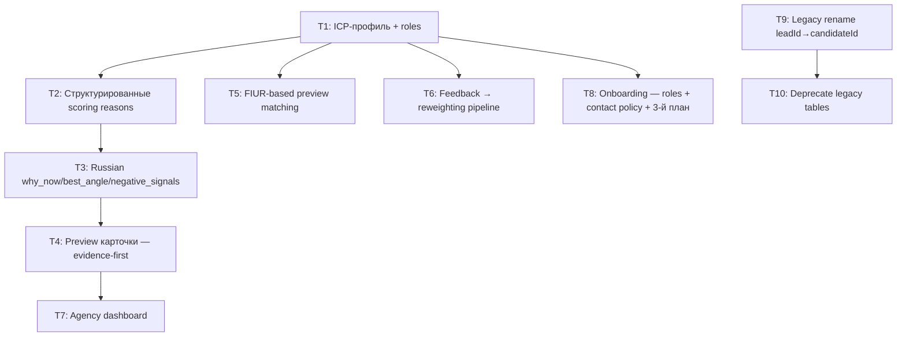

# План: Доработка под рекрутинговые агентства

**Дата:** 2026-06-12 (gaps пересмотрены 2026-06-13)
**Контекст:** Проект работает (745 тестов, tsc clean), но нужно устранить gaps между текущей реализацией и продуктом, описанным в SPEC.md, docs/product.md, docs/инфо о проекте.md. Фокус — довести до agency-ready качества.

> **Этот файл — дизайн-референс** (acceptance criteria, verification, риски, dependency graph).
> **Живые статусы задач T1–T11 → `tasks/todo-agency-refinement.md`.** Чекбоксы `[ ]` ниже
> отражают исходную постановку, не текущий прогресс. На 2026-06-13: Фаза 1 (T1/T2/T3)
> закрыта; gaps #2, #3, #6, #7, #8 ниже устранены.

---

## Текущее состояние (что уже есть ✅)

| Зона | Реализовано |
|---|---|
| FIUR scoring | `computeFiur` + 9 sub-helpers + confidence gates A/B/C/D |
| Lead card derivation | `why_now`, `best_angle`, `lawful_contact_path`, `negative_signals[]`, `inn`, `ogrn`, `domain`, `career_page_url` |
| Negative signals | `detectAgencyReposts()`, stale role penalty, internal recruiter penalty, single source flag |
| Contact policy | `contact_policy` enum + `filterContactPathsByPolicy` |
| Review queue | `review_status` + `/api/review` + review UI page |
| Prices | `PUBLIC_PLANS`: pilot 49 000 ₽, monthly 149 000 ₽/мес |
| Landing | hero formula «Компании, которым стоит написать сегодня», live preview, gate labels |
| Onboarding | 4-step: profile → Telegram → preview → complete |
| Digest delivery | Telegram + webhook + feedback buttons (Беру/Мимо/Позже/Скрыть/...) |
| Dashboard | overview, quality, sources, analytics, alerts |
| Leads page | table with score/gate/status/evidence filters |
| Sources | hh (production), career-pages, + 5 gated/context sources |

## Проблемы и gaps (что мешает быть agency-ready ❌)

### P0 — Блокеры запуска

1. **Preview фильтрует по keyword matching, не по FIUR** — landing показывает HhDigestItem с текстовым поиском, а не настоящий FIUR-based matching. Агентство не видит свой ICP-match в preview.
2. **ICP-профиль агентства неполный** — `client_profiles` хранит industries/companySizes/includeKeywords, но нет `roles` (какие роли закрывает агентство), нет `excludedIndustries`, нет `excludedLocations`, нет `remoteFriendly`, нет `contactPolicy` в onboarding-форме.
3. **Onboarding-форма не спрашивает роли агентства** — ключевой input для Fit-скоринга, но форма его не собирает.
4. **Legacy naming** — `updateLeadStatus`, `getLeadDeliveryRow`, `sendLeadToTelegram` params called `leadId` instead of `candidateId`. Запутывает и ломает связь с digest-моделью.
5. **Preview не показывает why_now / best_angle / negative_signals / lawful_contact_path** — карточки показывают только reasons + opener, а не полный evidence-first формат из продукта.

### P1 — Качество продукта

6. **`deriveWhyNow` / `deriveBestAngle` / `deriveLawfulContactPath` — текстовые эвристики** — ищут подстроки в English-language reasons. Не работает для Russian-language scoring reasons. Нужен структурированный output из scoring pipeline.
7. **Digest candidates хранят `reasons[]` как текст, а не структурированные объекты** — при обновлении FIUR-reasons на русский текст, все substring-based деривации сломаются.
8. **Client profiles не хранят `roles[]`** — FiurClientProfile.roles всегда пустой, Fit-скоринг за role-match не даёт баллов.
9. **Нет обратной связи suppression → future scoring** — feedback записывается в `client_digest_org_state`, но `FiurClientOverrides.industryFitPenalty` не populated из feedback history. Reweighting есть в тестах, но не подключён к digest pipeline.
10. **Dashboard — операционный мониторинг, не агентский радар** — заголовок «Радар источников», нет «сегодняшний радар», нет “компании, которым стоит написать сегодня”.

### P2 — Устойчивость и масштаб

11. **Техдолг: payments.ts 1729 строк** — монолит, тяжело менять checkout и billing.
12. **Техдолг: `packages/db/lib/` дублирует типы из `apps/web/lib/`** — два source of truth. ✅ ЗАКРЫТО (I7): мёртвый дубликат удалён, apps/web/lib — единый source of truth.
13. **DedupeService на JSON-файле** — в проде нужен Postgres.
14. **Rate limiter in-memory** — не работает для multi-instance.
15. **Нет третьего плана «Premium Desk»** — концепция требует 3 пакета (pilot / assisted / premium), в PUBLIC_PLANS только 2.
16. **Legacy таблицы leads/lead_status/deliveries** — не депрекейтнуты, нет плана миграции.

---

## Зависимости между задачами

**Критический путь:** T1 → T2 → T3 → T4 → T7. Без структурированных reasons нельзя правильно показать why_now/best_angle на русском; без FIUR preview нельзя показать агентству свой ICP-match.

---

## Фазы и задачи

### Фаза 1: Agency ICP и структурированный scoring (3–4 дня)

#### T1: Расширить ICP-профиль агентства — `roles[]`, `excludedIndustries`, `excludedLocations`, `remoteFriendly`

**Зависимости:** нет  
**Файлы:** `apps/web/lib/clientProfiles.ts`, migration, onboarding form

- [ ] 1.1 Миграция: `ALTER TABLE client_profiles ADD COLUMN roles TEXT[] DEFAULT '{}', excluded_industries TEXT[] DEFAULT '{}', excluded_locations TEXT[] DEFAULT '{}', remote_friendly BOOLEAN DEFAULT false`
- [ ] 1.2 Обновить `ClientProfile` type + `ClientProfileRow` + `mapClientProfileRow`
- [ ] 1.3 Обновить `INSERT`/`UPDATE` queries в `clientProfiles.ts`
- [ ] 1.4 Обновить `confirmPilotOrderProfile` action — принимать и сохранять roles, excludedIndustries, excludedLocations, remoteFriendly
- [ ] 1.5 Добавить `VALID_ROLES` set (it-engineering, data, product, sales, marketing, hr, finance, operations, legal, executive, other)
- [ ] 1.6 Добавить `contact_policy` в onboarding-форму (3 radio: corporate_only / no_personal / unrestricted)

**Acceptance criteria:**
- `client_profiles` содержит `roles`, `excluded_industries`, `excluded_locations`, `remote_friendly`
- Onboarding форма позволяет выбрать роли и contact policy
- `web:check` проходит

**Verification:** `npm run web:check` + manually test onboarding form

---

#### T2: Структурированные scoring reasons — типизированные объекты вместо строк

**Зависимости:** T1  
**Файлы:** `apps/web/lib/scoring/*.ts`, `apps/web/lib/leads-data.ts`, `apps/web/lib/hhDigest.ts`

- [ ] 2.1 Определить `ScoringReason` type: `{ component: 'fit'|'intent'|'urgency'|'reachability', key: string, params?: Record<string,string> }`
- [ ] 2.2 Обновить все compute* функции — возвращать `ScoringReason[]` вместо `string[]`
- [ ] 2.3 Создать `REASON_LABELS: Record<string, { ru: string }>` — маппинг reason key → русский текст
- [ ] 2.4 Обновить `computeFiur` return type: `reasons: { fit: ScoringReason[], intent: ScoringReason[], urgency: ScoringReason[], reachability: ScoringReason[] }`
- [ ] 2.5 Обновить `ScoringPipelineBreakdown` + `buildAgencyLead` — хранить структурированные reasons
- [ ] 2.6 Обновить `deriveWhyNow`, `deriveBestAngle`, `deriveLawfulContactPath`, `deriveNegativeSignals` — работать по reason.key, не по substring search
- [ ] 2.7 Digest candidates: `reasons` колонка хранит JSON `ScoringReason[]`, UI рендерит через `REASON_LABELS`

**Acceptance criteria:**
- Все scoring functions возвращают `ScoringReason[]`
- `deriveWhyNow` и `deriveBestAngle` работают по ключам, не по подстрокам
- Russian labels подставляются через `REASON_LABELS`
- `web:check` проходит, существующие тесты обновлены

**Verification:** `npm run web:check` + `cd apps/web && npx jest --silent`

---

#### T3: Russian why_now, best_angle, negative_signals — production-ready деривация

**Зависимости:** T2  
**Файлы:** `apps/web/lib/leads-data.ts`

- [ ] 3.1 Переписать `deriveWhyNow` — брать top urgency/intent reason keys, рендерить через `REASON_LABELS`
- [ ] 3.2 Переписать `deriveBestAngle` — маппинг reason-key → angle-template на русском
- [ ] 3.3 Переписать `deriveLawfulContactPath` — по reason-key, не по substring
- [ ] 3.4 Переписать `deriveNegativeSignals` — по reason-key + structured data (gate, sourceCount)
- [ ] 3.5 Unit-тесты для каждой функции с Russian output

**Acceptance criteria:**
- `deriveWhyNow` возвращает конкретный русский текст: «4 инженерные роли за 7 дней — hiring burst»
- `deriveBestAngle` возвращает: «Снять дефицитные роли, пока внутренний поиск не растянулся»
- `deriveNegativeSignals` возвращает структурированные русские сигналы
- 5+ unit тестов

**Verification:** `cd apps/web && npx jest src/__tests__/lib/leads-data --silent`

---

### Фаза 2: Agency-facing UI (3–4 дня)

#### T4: Preview карточки — evidence-first формат

**Зависимости:** T3  
**Файлы:** `apps/web/app/page.tsx`, `apps/web/lib/publicProduct.ts`, `apps/web/lib/hhDigest.ts`

- [ ] 4.1 Обновить `PreviewDigestCard` — показать: confidence gate label, why_now, best_angle, lawful_contact_path, negative_signals (если есть), source_count
- [ ] 4.2 Обновить `PublicPreviewItem` type — добавить whyNow, bestAngle, lawfulContactPath, negativeSignals
- [ ] 4.3 Обновить `toPublicPreviewItem` — деривировать новые поля
- [ ] 4.4 Обновить hero-signal-row example — показать evidence-first формат
- [ ] 4.5 Проверить preview → pilot flow end-to-end

**Acceptance criteria:**
- Preview карточка показывает why_now, best_angle, gate, sources count
- negative_signals показываются если есть
- lawful_contact_path показывается
- Click «Запустить пилот» → checkout → onboarding → Telegram → first digest

**Verification:** `npm run web:check` + manual visual inspection

---

#### T5: FIUR-based preview matching

**Зависимости:** T1  
**Файлы:** `apps/web/lib/publicProduct.ts`, `apps/web/lib/hhDigest.ts`

- [ ] 5.1 Заменить `matchesPreviewInput` (keyword substring) на FIUR-based scoring
- [ ] 5.2 `getPublicSampleDigestState` — ранжировать preview items по FIUR score для данного ICP
- [ ] 5.3 Использовать `FiurClientProfile` из preview input (specialization→roles, targetCity→locations, includeKeywords→industries)
- [ ] 5.4 Показать FIUR breakdown в preview карточке (fit/intent/urgency/reachability bars)

**Acceptance criteria:**
- Preview items ранжированы по FIUR, не по keyword match
- Выбор «IT-рекрутмент + Москва» показывает релевантные компании выше
- Gate labels соответствуют реальным confidence gates

**Verification:** `npm run web:check` + manual: задать профиль → проверить порядок и scoring

---

#### T6: Feedback → reweighting pipeline

**Зависимости:** T1  
**Файлы:** `apps/web/lib/clientProfileSignalOutcomes.ts`, `apps/web/lib/scoring/client-overrides.ts`, digest pipeline

- [ ] 6.1 Создать `computeClientOverrides(profileId)` — читать feedback history из `client_digest_org_state`, считать `industryFitPenalty` для индустрий с 3+ badfits
- [ ] 6.2 Подключить `computeClientOverrides` в digest scoring pipeline
- [ ] 6.3 Unit-тест: 3 badfits по индустрии X → penalty 0.5 для X
- [ ] 6.4 Integration: feedback «Мимо» по IT-компании → следующий digest понижает IT-лиды

**Acceptance criteria:**
- 3+ badfits по индустрии → auto penalty в следующий digest run
- Reweighting логируется в scoring reasons
- Unit + integration тесты проходят

**Verification:** `cd apps/web && npx jest --silent`

---

#### T7: Agency dashboard — «компании, которым стоит написать сегодня»

**Зависимости:** T4  
**Файлы:** `apps/web/app/dashboard/page.tsx`, dashboard components

- [ ] 7.1 Переименовать заголовок: «Радар источников» → «Ежедневный радар»
- [ ] 7.2 Добавить «Сегодняшний радар» секцию — top 5 candidates с why_now + best_angle
- [ ] 7.3 Добавить «Ожидают проверки» счётчик — review_status = pending
- [ ] 7.4 Показывать feedback funnel: сколько accepted/contacted/replied/won
- [ ] 7.5 Обновить nav: Дашборд / Лиды / Проверка

**Acceptance criteria:**
- Dashboard показывает «компании, которым стоит написать сегодня»
- Review queue count виден
- Feedback funnel актуален
- Nav включает Review

**Verification:** `npm run web:check` + manual

---

#### T8: Onboarding — roles + contact policy + 3-й план

**Зависимости:** T1  
**Файлы:** `apps/web/app/onboarding/pilot/[orderId]/page.tsx`, `pilot-onboarding-components.tsx`, `apps/web/lib/publicProduct.ts`

- [ ] 8.1 Добавить секцию «Роли, которые вы закрываете» в onboarding-форму (checkboxes из VALID_ROLES)
- [ ] 8.2 Добавить секцию «Contact policy» — corporate_only по умолчанию
- [ ] 8.3 Добавить третий план «Premium Desk» (290 000 ₽/мес) в `PUBLIC_PLANS`
- [ ] 8.4 Обновить checkout — поддерживать 3 плана
- [ ] 8.5 Обновить onboarding actions — сохранять roles + contactPolicy

**Acceptance criteria:**
- Onboarding форма собирает роли и contact policy
- 3 плана видны на landing и в checkout
- corporate_only — default contact policy
- `web:check` проходит

**Verification:** `npm run web:check` + manual onboarding flow

---

### Фаза 3: Cleanup и production readiness (2–3 дня)

#### T9: Legacy rename — leadId → candidateId

**Зависимости:** нет (можно параллельно с Фазой 1)  
**Файлы:** `apps/web/lib/db.ts`, `apps/web/app/api/digest/delivery/route.ts`

- [ ] 9.1 Rename `updateLeadStatus(leadId)` → `updateLeadStatus(candidateId)` (param name)
- [ ] 9.2 Rename `getLeadDeliveryRow(leadId)` → `getLeadDeliveryRow(candidateId)`
- [ ] 9.3 Rename `sendLeadToTelegram(leadId)` → `sendLeadToTelegram(candidateId)`
- [ ] 9.4 Обновить все callers
- [ ] 9.5 Обновить logging/context references

**Acceptance criteria:**
- Нет параметров `leadId` в digest-related функциях
- Все callers обновлены
- `web:check` проходит

**Verification:** `npm run web:check` + `cd apps/web && npx jest --silent`

---

#### T10: Deprecate legacy tables — plan + migration

**Зависимости:** T9  
**Файлы:** migration, `docs/self-serve-mvp.md`

- [ ] 10.1 Написать deprecation plan: какие таблицы (leads, lead_status, deliveries), когда удалять, какие migration steps
- [ ] 10.2 Добавить SQL comment `-- DEPRECATED: see digest_candidates instead` на legacy tables
- [ ] 10.3 Убедиться что ни один production query не читает из legacy tables
- [ ] 10.4 Не удалять таблицы — только пометить и задокументировать

**Acceptance criteria:**
- Deprecation plan документирован
- Legacy tables помечены deprecated
- Нет production queries к legacy tables

**Verification:** `npm run web:check` + grep for legacy table references

---

#### T11: payments.ts split

**Зависимости:** нет (можно параллельно)  
**Файлы:** `apps/web/lib/payments.ts` → split

- [ ] 11.1 Выделить `lib/payments-checkout.ts` (~400 строк) — checkout order CRUD + onboarding state
- [ ] 11.2 Выделить `lib/payments-billing.ts` (~400 строк) — billing webhook + entitlement logic
- [ ] 11.3 Выделить `lib/payments-stripe.ts` (~300 строк) — Stripe-specific integration (already partially exists)
- [ ] 11.4 Оставить `lib/payments.ts` как re-export facade (~100 строк)
- [ ] 11.5 Обновить все imports

**Acceptance criteria:**
- Ни один файл не длиннее 500 строк
- Все imports обновлены
- `web:check` + все тесты проходят

**Verification:** `npm run web:check` + `cd apps/web && npx jest --silent`

---

## Чекпоинты

| Чекпоинт | После | Критерий |
|---|---|---|
| **CP1** | Фаза 1 complete | FIUR scoring использует `roles[]`, reasons структурированные, why_now/best_angle на русском, `web:check` + 745+ тестов |
| **CP2** | Фаза 2 complete | Preview показывает FIUR-based evidence-first карточки, onboarding собирает roles + contact policy, feedback → reweighting работает |
| **CP3** | Фаза 3 complete | Legacy renamed, deprecated, payments split, 3 плана, `web:check` clean |

---

## Риски

1. **Structured reasons — breaking change** — нужно обновить все consumers of `reasons[]`. Mitigation: `reasons` column in DB хранит JSON, добавить migration для конвертации.
2. **FIUR preview matching — performance** — scoring каждого preview item на лету может быть медленным. Mitigation: pre-compute или cache для landing page.
3. **Onboarding form complexity** — добавление roles + contact policy + excluded items может перегрузить форму. Mitigation: progressive disclosure (details/summary уже используется).

---

## Что НЕ входит в этот план

- P2 source expansion (linkedin, superjob, habr — gated sources)
- Redis rate limiter
- DedupeService → Postgres migration
- CRM export
- White-label
- AI summarization layer (LLM audit trail)
- 152-ФЗ compliance documentation
- Multi-tenant isolation hardening
